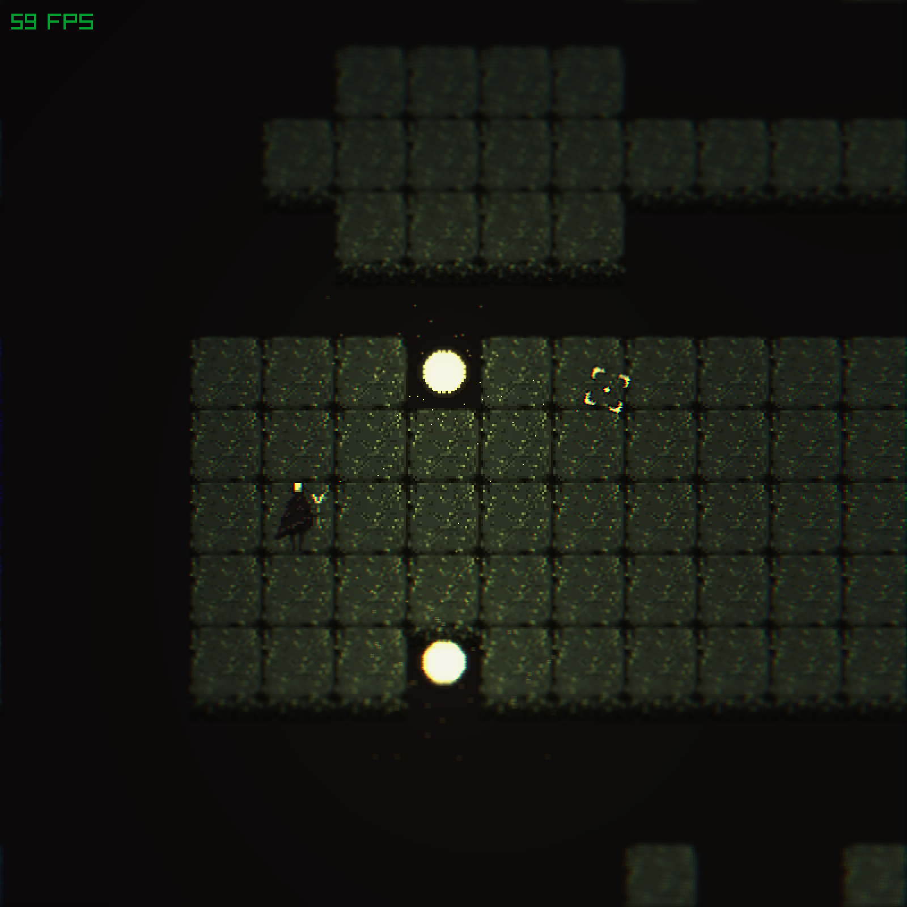

# Raylib Dungeon

Some experiments with video game development using [Raylib](https://www.raylib.com/) and [Go](https://github.com/gen2brain/raylib-go).

## Controls

- `WASD` to move
- `[/]` to zoom in/out
- `F2` to screenshot
